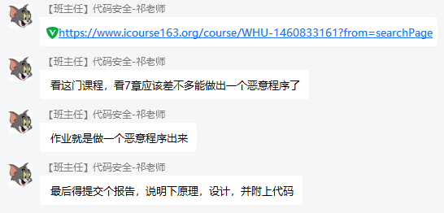

## 代码安全实践

### ℹ基本信息

+ 任课教师：祁晖老师

+ 授课方式：实践课

+ 授课时间：2021-2022学年度第一学期

+ 考核方式：实践报告和源代码

###  📁相关资料

+ [武汉大学-软件安全之恶意代码机理与防护](https://www.icourse163.org/course/WHU-1460833161?from=searchPage)

###  ⚠注意事项

+ 实践课要求如下：

+ 

### 👤贡献者

+ 200531201